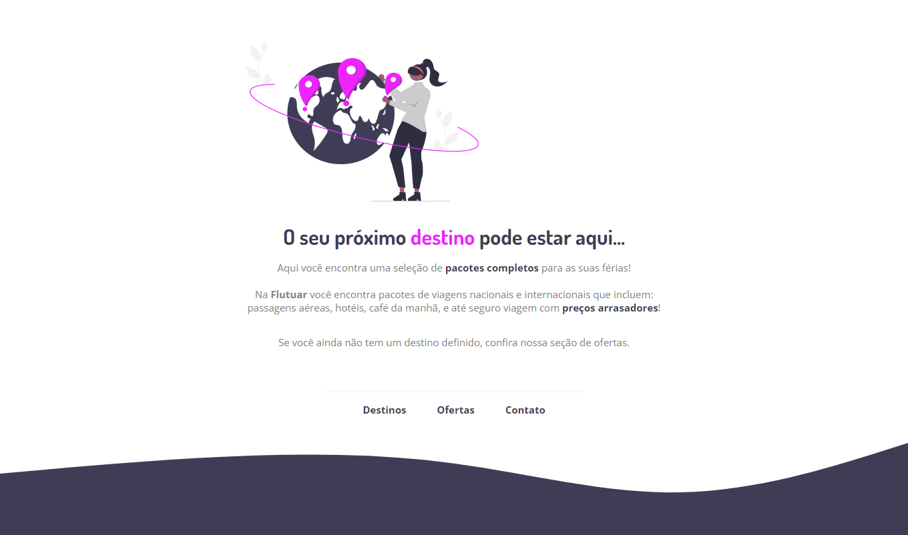

<h1 align="center">Projeto: Flutuar - Seu Próximo Destino
</h1>

Desafio extra - explorer stag 2

  <a href="#-tecnologias">Tecnologias</a>&nbsp;&nbsp;&nbsp;|&nbsp;&nbsp;&nbsp;
  <a href="#-projeto">Projeto</a>&nbsp;&nbsp;&nbsp;|&nbsp;&nbsp;&nbsp;
  <a href="#-como-executar">Como executar</a>&nbsp;&nbsp;&nbsp;|&nbsp;&nbsp;&nbsp;
  <a href="#memo-licença">Licença</a>

  

 

  

## 🚀 Tecnologias

Esse projeto foi desenvolvido com as seguintes tecnologias:

- HTML e CSS

## 💻 Projeto

Este projeto simula um site promocional para a Flutuar, uma agência de viagens que oferece pacotes completos para destinos nacionais e internacionais.

Este projeto foi desenvolvido para proporcionar uma experiência agradável e informativa aos usuários, ajudando-os a encontrar o seu próximo destino de viagem com facilidade e confiança.

## 🔖 Como executar

Clone o repositório para o seu ambiente local.

Abra o arquivo index.html no seu navegador preferido.

## :memo: Licença

Esse projeto está sob a licença MIT.
